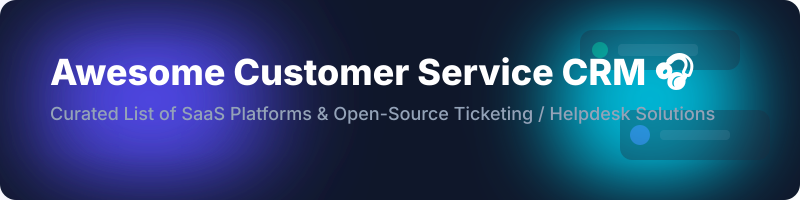

# 🎧 Awesome Customer Service CRM

  
  
  
  
  

> **Curated list of top SaaS products and open-source GitHub repositories for Customer Service CRM, Helpdesk, Ticketing Systems, Live Chat, Knowledge Base, and Omnichannel Support.**

---

## 📖 Table of Contents

- [☁️ SaaS/Hosted Platforms](#️-saashosted-platforms)
- [🔓 Open-Source GitHub Projects](#-open-source-github-projects)
- [🤝 How to Contribute](#-how-to-contribute)
- [☕ Support](#-support)
- [⚠️ Disclaimer](#️-disclaimer)
- [📈 Star History](#-star-history)

---

## ☁️ SaaS/Hosted Platforms

> **📊 Market Context**: The global customer service software market is estimated at **~$12B in 2026**, growing toward **~$28B by 2032** at a **~15% CAGR**. The sector is **moderately fragmented** — **Zendesk** and **Salesforce** dominate the enterprise tier, while **Freshdesk** and **Zoho Desk** compete aggressively on price and AI bundling. No single vendor holds a winner-take-all position; enterprises typically run multi-vendor stacks.

| Platform | Description | Pricing (Starting Tier) | Free Tier Limits / Free Trial | Company Size (Revenue / Valuation) |
|---|---|---|---|---|
| **[Microsoft Dynamics 365 Customer Service](https://dynamics.microsoft.com/en-us/customer-service/)** 🏢 | Enterprise customer service within Dynamics 365 with AI case routing, Power BI analytics, and Teams integration. | **$105/user/month** (Professional tier) | **30-day free trial** (No perpetual free tier) | **~$281B revenue** (Microsoft FY2025) |
| **[Salesforce Service Cloud](https://www.salesforce.com/service/)** ☁️ | Enterprise standard for CRM, omnichannel routing, knowledge base, and Agentforce AI agents. | **$25/user/month** (Starter Suite) | **30-day free trial** (No perpetual free tier) | **~$37.9B revenue** (Salesforce FY2025) |
| **[ServiceNow CSM](https://www.servicenow.com/products/customer-service-management.html)** ⚡ | Enterprise Customer Service Management platform with workflow automation and field service. | **$75/user/month** (Now Assist AI add-on, base tier contact sales) | **30-day developer instance / demo access** (No perpetual free tier) | **~$10.9B revenue** (ServiceNow FY2025) |
| **[Zendesk](https://www.zendesk.com/pricing/)** 💬 | Widely adopted helpdesk platform supporting email ticketing, live chat, voice, and AI agents. | **$55/agent/month** (Suite Team) | **14-day free trial** (No perpetual free tier) | **~$2.1B revenue** (Zendesk est.) |
| **[Intercom](https://www.intercom.com/pricing)** 🤖 | AI-first customer service platform featuring Fin AI Agent across live chat, email, and voice. | **$29/seat/month** (Essential) | **14-day free trial** (Startup program offers 93% off) | **~$1.3B valuation** (Private) |
| **[Zoho Desk](https://www.zoho.com/desk/pricing.html)** 📑 | Context-aware helpdesk with AI assistant Zia, email, live chat, and telephony integration. | **$14/user/month** ($10/mo billed annually) | **Free Forever**: **3 free agents** (Basic ticketing & Knowledge base) | **~$1.0B+ revenue** (Zoho Corp est.) |
| **[Freshdesk](https://www.freshdesk.com/pricing/)** 🎯 | Comprehensive helpdesk with Freddy AI, ticketing automation, and omnichannel capabilities. | **$15/agent/month** ($19/mo billed monthly) | **Free Forever**: **Up to 10 agents** (Basic ticketing, knowledge base) | **~$600M+ revenue** (Freshworks) |
| **[Kustomer](https://www.kustomer.com/pricing/)** 👥 | Omnichannel customer service platform built around single customer views and AI automation. | **$89/user/month** (Enterprise tier) | **14-day trial upon request** (No perpetual free tier) | **~$250M valuation** (Divested from Meta) |
| **[Help Scout](https://www.helpscout.com/pricing/)** 📩 | Simple, human-friendly customer support platform with shared inboxes and Docs knowledge base. | **$20/user/month** (Standard) | **14-day free trial** (No perpetual free tier) | **~$100M+ valuation** (Private) |
| **[Gorgias](https://www.gorgias.com/pricing)** 🛍️ | E-commerce dedicated helpdesk integrated deeply with Shopify, BigCommerce, and Magento. | **$50/month** (Basic - 50 billable tickets) | **7-day free trial** (No perpetual free tier) | **~$100M+ valuation** (Private) |

---

## 🔓 Open-Source GitHub Projects

Sorted by GitHub star count (descending).

| Repo | Description | Stars |
|---|---|---|
| **[Chatwoot](https://github.com/chatwoot/chatwoot)** 💬 | **Open-source customer engagement platform.** Omnichannel support (Web, WhatsApp, Instagram, Messenger, Telegram, SMS), AI agent capabilities, help center, and live chat. Built with Ruby on Rails & Vue. |  |
| **[Odoo Helpdesk](https://github.com/odoo/odoo)** 🏢 | **Open-source ERP suite including Helpdesk & Customer Support.** Comprehensive ticketing, SLA management, and customer portal integrated with full business suite. Python/JavaScript. |  |
| **[Zammad](https://github.com/zammad/zammad)** 🛡️ | **Feature-complete web-based open-source helpdesk / customer support system.** Omnichannel integration, SLA management, time tracking, and REST API. Ruby/PostgreSQL. |  |
| **[FreeScout](https://github.com/freescout-helpdesk/freescout)** ✉️ | **Lightweight open-source Zendesk & Help Scout alternative.** PHP/MySQL based shared inbox and helpdesk, zero dependencies, responsive UI, and 100+ community modules. |  |
| **[osTicket](https://github.com/osTicket/osTicket)** 🎟️ | **Widely deployed open-source support ticket system.** Seamlessly routes inquiries created via email, web-forms, and API into a simple multi-user web interface. PHP/MySQL. |  |
| **[Erxes](https://github.com/erxes/erxes)** 🚀 | **Open-source experience management platform (XMP).** Combines customer service, live chat, email marketing, sales pipeline, and self-service knowledge base. Node.js/GraphQL. |  |
| **[Peppermint](https://github.com/Peppermint-Lab/peppermint)** 🌿 | **Modern open-source ticket management system.** Docker-ready helpdesk solution for small teams with clean interface and client portal. Node.js/React. |  |
| **[Helpy](https://github.com/helpyio/helpy)** 🙋 | **Open-source helpdesk & customer support community forum.** Ticketing, community Q&A forums, and multi-lingual knowledge base. Ruby on Rails. |  |
| **[Live Helper Chat](https://github.com/LiveHelperChat/livehelperchat)** 🗨️ | **Flexible open-source live chat and helpdesk plugin.** Multi-channel web chat with bot integrations, voice call capabilities, and mobile apps. PHP/MySQL. |  |
| **[UVdesk](https://github.com/uvdesk/community-skeleton)** 📦 | **Enterprise-grade open-source helpdesk system.** Built on Symfony framework with email piping, workflow automation, and custom app extensions. PHP. |  |
| **[Trudesk](https://github.com/polonel/trudesk)** 📊 | **Open-source helpdesk ticketing system.** Real-time chat, task tracking, ticketing dashboard, and reporting. Node.js/MongoDB. |  |

---

## 🤝 How to Contribute

Contributions are welcome! 🎉

1. Fork this repository.
2. Add or update entries in `README.md` maintaining alphabetical or star order as appropriate.
3. Ensure links, pricing details, or repository licenses are accurate and factual.
4. Open a Pull Request detailing your changes.

---

## ☕ Support

If you find this repository helpful, consider supporting the maintainer:

- ⭐ **Star** this repository to show your appreciation!
- 🔀 **Fork** and share with your team or community.
- ☕ **Buy Me a Coffee**: Support ongoing maintenance via [GitHub Sponsors](https://github.com/sponsors/ishandutta2007).

---

## ⚠️ Disclaimer

- This is a community-curated list and does not constitute an endorsement.
- All product names, logos, and brands are property of their respective owners.
- Customer service CRM software handles customer PII; ensure compliance with data protection laws (GDPR, CCPA).

---

## 📈 Star History

